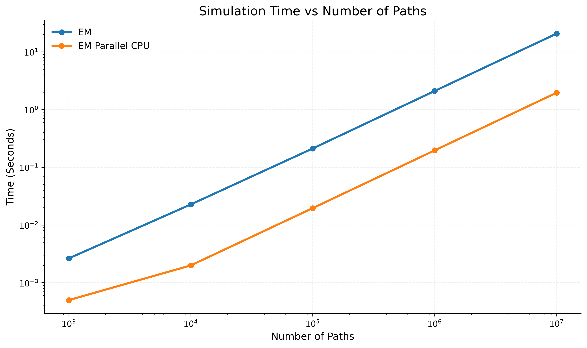
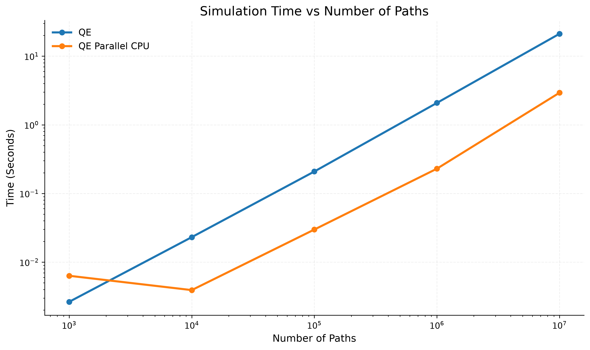

# Heston Monte Carlo Pricing Engine (C++20/CUDA)

[](https://github.com/jairosp/heston_monte_carlo/actions/workflows/tests.yml)


## Overview
This is my first serious quantitative finance project, combining C++ and CUDA to build a high-performance Monte Carlo pricing engine. The project focuses on pricing European call options under the Heston stochastic volatility model.

To demonstrate the performance benefits of parallelization, we can compare the execution times of the Euler–Maruyama method with and without CPU parallelization. For the same number of simulated paths, CPU parallelization delivers approximately a 10× speedup.



A similar effect can be observed with the Quadratic Exponential (QE) scheme. Although this method involves additional computations and may appear slower at first glance, it is generally more robust and still achieves a consistent ~10× speedup through CPU parallelization.



Both approaches exhibit comparable performance gains from CPU parallelization. The next step is to investigate whether these results can be improved further through GPU acceleration and massive parallelization using CUDA.

## Build and Run

### Requirements

- Linux
- CMake 3.25+
- C++20 compiler
- OpenMP
- Python 3

### Build

```bash
git clone https://github.com/jairosp/heston_monte_carlo.git
cd heston_monte_carlo

cmake -B build -DCMAKE_BUILD_TYPE=Release
cmake --build build
```

### Run

```bash
./build/heston_sim
```

Parallel CPU engine:

```bash
./build/heston_sim --parallel
```

CUDA engine:

**WARNING** This is not yet implemented. 

```bash
./build/heston_sim --gpu
```

Quadratic-Exponential scheme (Euler scheme by default):

```bash
./build/heston_sim --qe
```

### Tests

```bash
ctest --test-dir build --output-on-failure
```

### Benchmarks

```bash
cmake --build build --target run_benchmarks
```

Benchmark results are stored in `benchmarks/benchmarks.csv`, while generated reports are written to `benchmarks/reports/`.

## Continuous Integration

Unit tests are automatically executed through GitHub Actions on every push and pull request. For now, unit tests validate
- Convergence to price.
- Financial properties (positive price...)
- Randon generators and their properties
All of these across all the variations of engines and schemes.

## Goals
Create and measure a robust pricing engine parallelizing with CUDA. Taking advantage of the Monte Carlo simulation parallel potential. First I have built an entire library for simulating the Heston Model. At every stage I implement both the Euler Maruyama and the Quadratic Exponential appraoches to compare them.

Current stage: Parallelizing both on CPU (Done!) and GPU (In progress!) in order to make a fair comparison between approaches.

My main goal is to show or dismantle the fact that CUDA Parallelization can bring massive improvements in efficiency and put to practice my recently acquired CUDA/C++ skills in a large scale project.

## Mathematical Model and Foundations
The Heston model is a stochastic volatility model in which both the asset price ($S_t$) and its variance ($v_t$) evolve randomly over time.

$$
dS_t = rS_t,dt + \sqrt{v_t}S_t,dW_t^S
$$

$$
dv_t = \kappa(\theta - v_t),dt + \xi\sqrt{v_t},dW_t^v
$$

with correlation 

$$
(dW_t^S dW_t^v = \rho,dt).
$$

Since no closed-form solution exists for the simulated paths, option prices are estimated using Monte Carlo simulation. The first discretization scheme implemented is Euler–Maruyama (EM), a simple and widely used numerical method for stochastic differential equations. We then implement the Quadratic Exponential (QE) scheme, which is specifically designed for the Heston variance process and generally provides greater stability and accuracy while preserving the positivity of variance.

## Project Structure

* **.github/**: GitHub workflows for CI/CD.
* **benchmarks/**: Benchmarking scripts, reports, plots, and performance comparisons between different pricing engines and numerical schemes.
* **docs/**: Weekly project logs documenting progress, challenges, milestones, and future goals.
* **include/**: Header files and project interfaces.

  * **core/**: Core types, interfaces, and shared utilities.
  * **cpu/**: CPU-based pricing engines and supporting components.
  * **cuda/**: GPU/CUDA implementations and related utilities.
  * **tests/**: Shared utilities and helper structures used by the test suite.
* **scripts/**: Python scripts used for data analysis and plot generation.
* **src/**: Source code implementation. In addition to the corresponding `.cpp` files, it contains the project entry point (`main.cpp`).
* **tests/**: Unit and validation tests covering convergence, financial properties, reproducibility, and implementation-specific behavior.


## Validation

* Compare prices against reference implementations and analytical benchmarks when available.
* Verify key financial properties and no-arbitrage bounds.
* Test edge cases across a wide range of market and model parameters.

## Performance (CPU vs GPU)

* **CPU:** OpenMP parallelization achieves approximately a 10× speedup compared to the sequential implementation.
* **GPU:** CUDA implementation currently in development. Additional performance gains are expected through massive parallel execution.

## Future Work

* Extend support to additional option types (e.g., puts, barrier options, Asian options).
* Add support for other stochastic volatility and local volatility models.
* Implement variance reduction techniques to improve Monte Carlo efficiency.
* Further optimize GPU kernels and memory usage.
