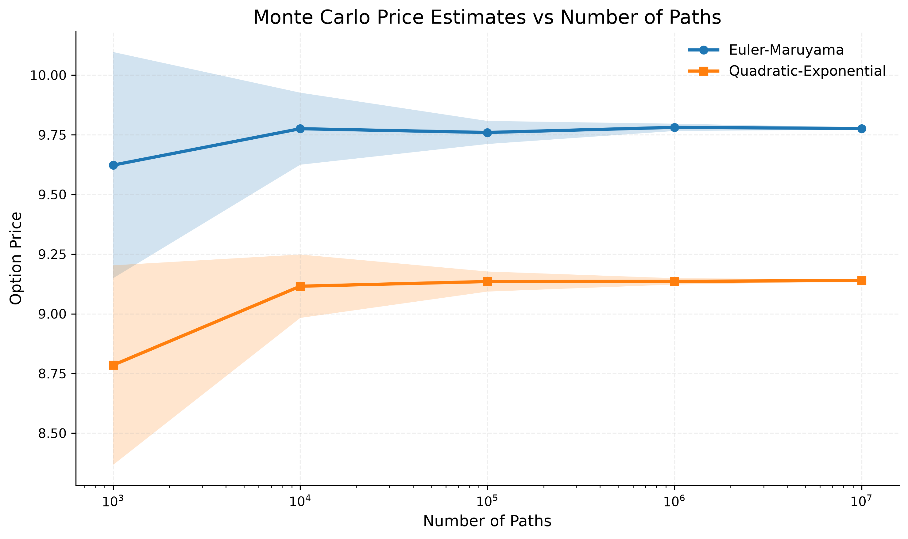

# Heston Monte Carlo Pricing Engine (C++20/CUDA)

## Overview
First serious finance project blending my C++ and CUDA knowledge to create something interesting. This project in particular will focus on pricing european call options. One first result by comparing Euler Maruyama and QE-Scheme for solving Heston model, has resulted in the following graph:

We can see how the QE approach price differs from the EM approach. Also we can see how the std error diminishes: 

Both approaches seem to deliver a similar std error across different number of paths.

## Goals
Create and measure a robust pricing engine parallelizing with CUDA. Taking advantage of the Monte Carlo simulation.

## Mathematical Model and Foundations
Heston Model, (develop further: Cholesky, Numerical stability...)

## Project Structure
include/: hpp files
src/: main files and logic
tests/ : testing and quality assurance
docs/ : general notes & weekly log
benchmarks/ : testing against real data, python scripts that convert results into graphs

## Validation (Real Data)
Test against other pricing engines
Check edge cases

## Performance (CPU vs GPU)
How much could we optimize with this approach?

## Future Work
Add new types of assets