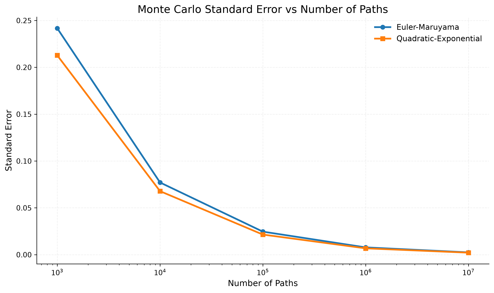

# Heston Monte Carlo Pricing Engine (C++20/CUDA)

## Overview
This is my first serious quantitative finance project, combining C++ and CUDA to build a high-performance Monte Carlo pricing engine. The project focuses on pricing European call options under the Heston stochastic volatility model.

To demonstrate the performance benefits of parallelization, we can compare the execution times of the Euler–Maruyama method with and without CPU parallelization. For the same number of simulated paths, CPU parallelization delivers approximately a 10× speedup.

A similar effect can be observed with the Quadratic Exponential (QE) scheme. Although this method involves additional computations and may appear slower at first glance, it is generally more robust and still achieves a consistent ~10× speedup through CPU parallelization.

Both approaches exhibit comparable performance gains from CPU parallelization. The next step is to investigate whether these results can be improved further through GPU acceleration and massive parallelization using CUDA.

## Goals
Create and measure a robust pricing engine parallelizing with CUDA. Taking advantage of the Monte Carlo simulation.

## Mathematical Model and Foundations
Heston Model, (develop further: Cholesky, Numerical stability...)

## Project Structure
include/: hpp files
src/: main files and logic
tests/ : testing and quality assurance
docs/ : general notes & weekly log
benchmarks/ : testing against real data, python scripts that convert results into graphs

## Validation (Real Data)
Test against other pricing engines
Check edge cases

## Performance (CPU vs GPU)
How much could we optimize with this approach?

## Future Work
Add new types of assets